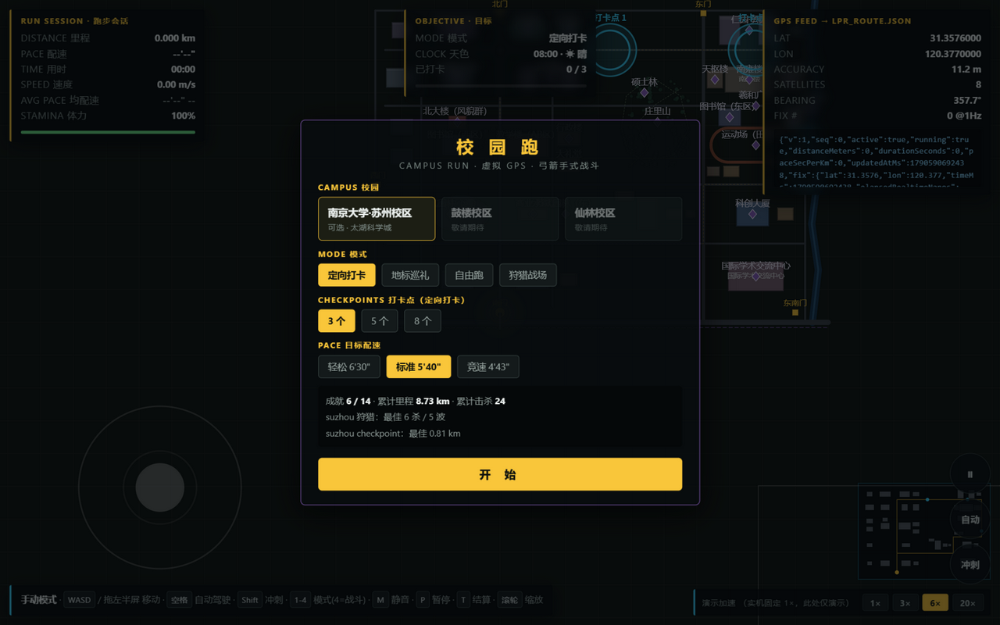
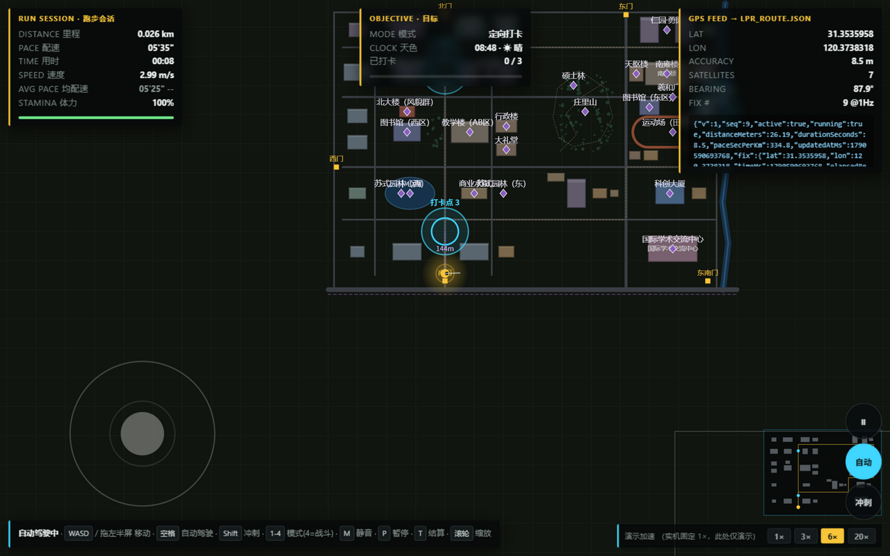
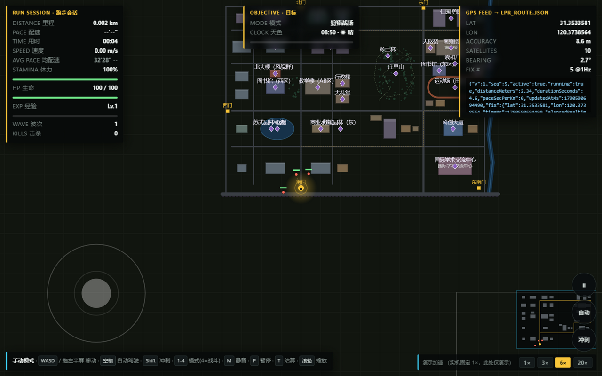
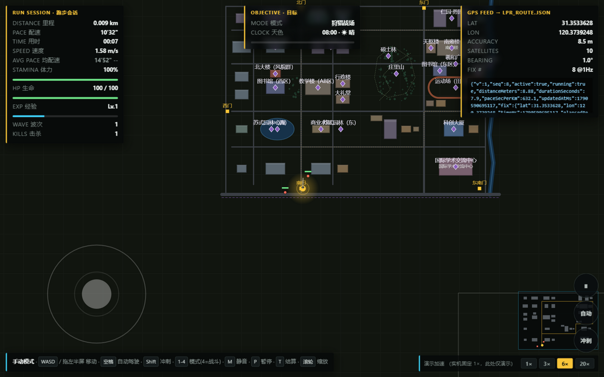

# 校园跑 Campus Run 🏃️‍♂️🏹

**2D 俯视校园跑 + 虚拟 GPS 坐标流 + 弓箭手大作战式战斗。**
浏览器里双击即玩的完整 Demo，配一套可跑在 Unity / Android 虚拟定位上的同构 C# Core。

| 开始菜单 | 定向打卡 | 狩猎战场 | 夜雨战斗 |
| --- | --- | --- | --- |
|  |  |  |  |

## 这是什么

- **校园跑模拟**：在 1:1 比例的校园地图上跑步，GPS 轨迹经过配速模型、OU 抖动、
  精度/卫星数模拟，按 1Hz 产出与真实定位一致的 `lpr_route.json` 坐标流。
- **弓箭手式战斗（狩猎战场）**：走位躲避、**停下自动索敌开火**，波次敌人 +
  BOSS 环射，击杀得经验，**升级三选一天赋**（多重射击/穿透/弹射/环射…）。
- **跑步玩法**：定向打卡（点标越野）、地标巡礼（打卡 27 处校园地标）、自由跑。
- **表现层**：昼夜循环、晴/多云/雨天气、小地图、WebAudio 合成音效、尘土/彩带粒子。
- **成长系统**：14 项成就、每校园×模式最佳记录（localStorage，容错降级）。

## 快速开始

```bash
# ① 浏览器 Demo —— 直接双击
demo/index.html
# 或者起个静态服务
python -m http.server -d demo 8642   # 打开 http://127.0.0.1:8642/

# ② 无头验证（Node ≥ 18）
node tools/verify-demo.js            # 58 项检查，全绿

# ③ C# Core 仿真（.NET ≥ 8）
dotnet run -c Release --project tools/SimHarness

# ④ 一键全量验证（Windows / PowerShell）
./verify-all.ps1                     # C# + JS + Unity 树 + Android 工件
```

操作：`WASD`/拖动左半屏移动 · `Shift` 冲刺（消耗体力）· `空格` 自动驾驶 ·
`1-4` 切换模式（4=狩猎战场）· `M` 静音 · `P/Esc` 暂停 · `T` 结算 · 滚轮缩放。

## 玩法说明

| 模式 | 说明 |
| --- | --- |
| 定向打卡 | 沿 3.47km 主环线随机刷打卡点，进圈即打卡，配速越界会被 App 判无效 |
| 地标巡礼 | 靠近地标 30~70m 半径自动发现，集齐 27 处 |
| 自由跑 | 无目标，纯跑 + 看风景 |
| 狩猎战场 | 弓箭手大作战式：停下自动射击；追击/射手/冲锋怪每 11s 一波，每 5 波 BOSS；击杀得经验升级三选一；HP 归零结算 |

配速合法性带 **3'00"~9'00"/km**（模拟真实运动 App 的配速校验），
冲刺 ×1.55 是走位保命资源；无论战斗还是跑步，里程都照常计入 GPS 里程。

## 工程结构

```
demo/                 浏览器 Demo（纯静态，file:// 可玩）
  js/geo.js           几何/地理基础（Vec、Polyline、LocalFrame、Rng）
  js/campus*.js       校园注册表 + 苏州校区数据 + 模板校园
  js/sim.js           配速/抖动/GPS/跑步会话
  js/battle.js        战斗层（敌人/子弹/波次/升级，确定性可测）
  js/store.js         成就/记录（localStorage 容错）
  js/env.js           昼夜循环/天气        js/sfx.js  WebAudio 音效
  js/render.js ui.js  渲染 / HUD           js/main.js 主循环
unity/                Unity 客户端
  Assets/Scripts/Core/*    C# Core（与 JS 同构，无 UnityEngine 依赖）
  Assets/Scripts/*.cs      Unity 渲染壳（Bootstrap/Renderer/Hud/Bridge）
android-plugin/       MockLocationDriver AAR（把坐标流注入系统定位）
tools/SimHarness      .NET 无头仿真（构建校验 + 轨迹输出）
tools/verify-demo.js  JS 无头验证（58 项）
docs/                 数据契约与校区数据说明
```

## 数据契约

坐标流（写入 `/data/local/tmp/lpr_route.json`，Android 端轮询注入）：

```json
{
  "v": 1, "seq": 835, "active": true, "running": true,
  "distanceMeters": 2501.58, "durationSeconds": 835.0, "paceSecPerKm": 278.8,
  "updatedAtMs": 1790590590872,
  "fix": { "lat": 31.3584279, "lon": 120.3814773, "timeMs": 1790590590872,
           "elapsedRealtimeNanos": 835000000000, "accuracy": 9.12,
           "speed": 3.587, "bearing": 177.61, "altitude": 11.35,
           "satellites": 9, "provider": "gps" }
}
```

字段级说明见 [docs/DATA-CONTRACT.md](docs/DATA-CONTRACT.md)；
苏州校区数据来源与坐标口径见 [docs/CAMPUS-SUZHOU.md](docs/CAMPUS-SUZHOU.md)。

## 校园数据

- **南京大学·苏州校区**：`demo/js/campus-suzhou.js`（JS）/ `CampusLayout.CreateSuzhou()`（C#），
  38 栋建筑、14 条道路、中心湖 + 九曲河、27 处地标、5 校门、3.47km 主环线。
- 鼓楼 / 仙林校区：开始菜单中「敬请期待」，注册表已按 id 预留。

## 免责声明

- 本项目仅用于**学习、演示与技术验证**（GPS 轨迹仿真 / 游戏开发 / 虚拟定位原理）。
- 校区地图坐标为公开资料的**近似值**，不代表精确测绘；名称与商标归原权属方所有。
- 请遵守当地法律法规与校园管理规定，**勿将虚拟定位用于任何违规场景**。
- 运行 Demo 不采集任何真实位置信息。

## License

[MIT](LICENSE)
